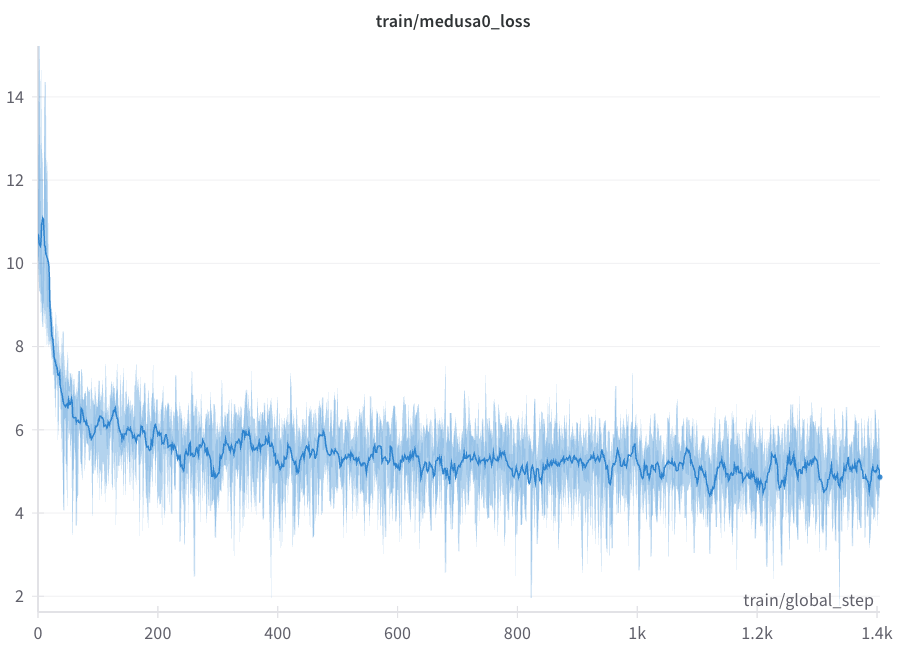

# Medusa: Fast LLM Inference with Speculative Decoding

This repository provides a framework for efficient speculative decoding with large language models (LLMs). The core idea is to enable users to bring their own base model, train speculative heads for parallel token prediction, and deploy the resulting model for fast ONNX-based inference (upto 3x the inference speed).

## Overview

Medusa enables:
- Integration of any HuggingFace-compatible base model (e.g., Vicuna, Llama)
- Training of speculative heads for parallel next-token prediction
- ONNX export for accelerated inference
- Simple, modular code for research and extension

## Pretrained Model

A ready-to-use speculative decoding model checkpoint is available on Hugging Face Hub:

- **Model ID:** `theharshithh/vicuna-7b-speculative`
- **URL:** [https://huggingface.co/theharshithh/vicuna-7b-speculative](https://huggingface.co/theharshithh/vicuna-7b-speculative)

This checkpoint is based on Vicuna-7B and includes trained speculative heads.

## Workflow

### 1. Model and Training Configuration

Configure your base model and speculative head parameters in `start_train.sh`. This script manages distributed training across multiple GPUs. Key arguments:
- `--model_name_or_path`: Path or identifier for your base model
- `--medusa_num_heads`: Number of speculative heads
- `--medusa_num_layers`: Number of layers per head

To launch training:
```bash
chmod +x start_train.sh
./start_train.sh
```

### 2. Dataset Preparation

Use `setup_dataset.py` to split your dataset into training and evaluation sets. The script expects a ShareGPT-style JSON by default, but can be adapted for other formats. Example usage:
```bash
python setup_dataset.py --input_file your_data.json
```
This produces `train.json` and `eval.json`.

The data loading and formatting logic is implemented in `dataset.py`. Review or modify this file to customize conversation formatting or tokenization as needed.

### 3. ONNX Export and Inference

After training, export your model to ONNX and perform inference using `inference/infer_onnx.py`:
```bash
python inference/infer_onnx.py
```
This script exports both the model and tokenizer, and provides a test generation example.

### 4. Training Loss Visualization

Below are the speculative head loss curves from a short training run (limited GPU resources):

<p align="center">
  
  
  
</p>

<p align="center">
  <b>Head 0 Loss</b> &nbsp;&nbsp;&nbsp;&nbsp; <b>Head 1 Loss</b> &nbsp;&nbsp;&nbsp;&nbsp; <b>Head 3 Loss</b>
</p>

These results were obtained with constrained compute. Extended training and additional resources are expected to further reduce loss.

## Code Structure
- `model.py`, `utils.py`: Core logic for speculative heads and Medusa model
- `start_train.sh`: Distributed training entry point
- `setup_dataset.py`, `dataset.py`: Dataset preparation and formatting
- `inference/infer_onnx.py`: ONNX export and inference
- `spec_choices.py`: Configuration for speculative head choices

## Quick Start
1. Prepare your dataset with `setup_dataset.py`
2. Configure and launch training via `start_train.sh`
3. Export and test ONNX inference with `inference/infer_onnx.py`
4. Monitor training progress using the provided loss plots in `static/`

## Notes
- The codebase is modular and intended for research and extension.
- Loss plots reflect short training runs; longer training is recommended for optimal results.
